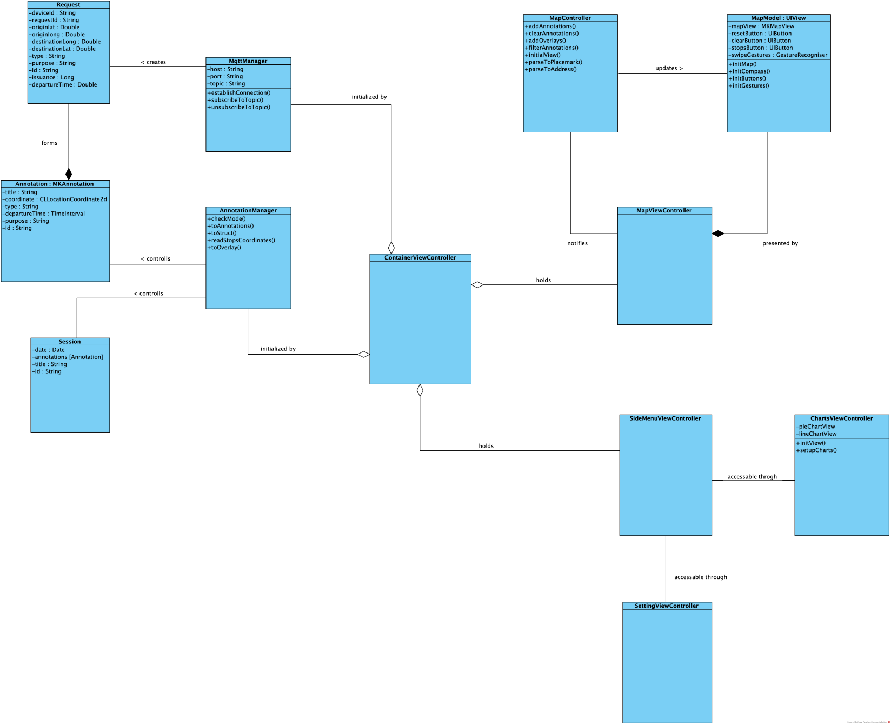
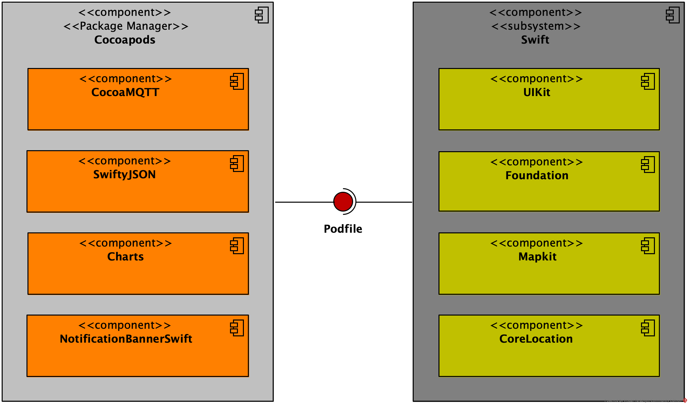
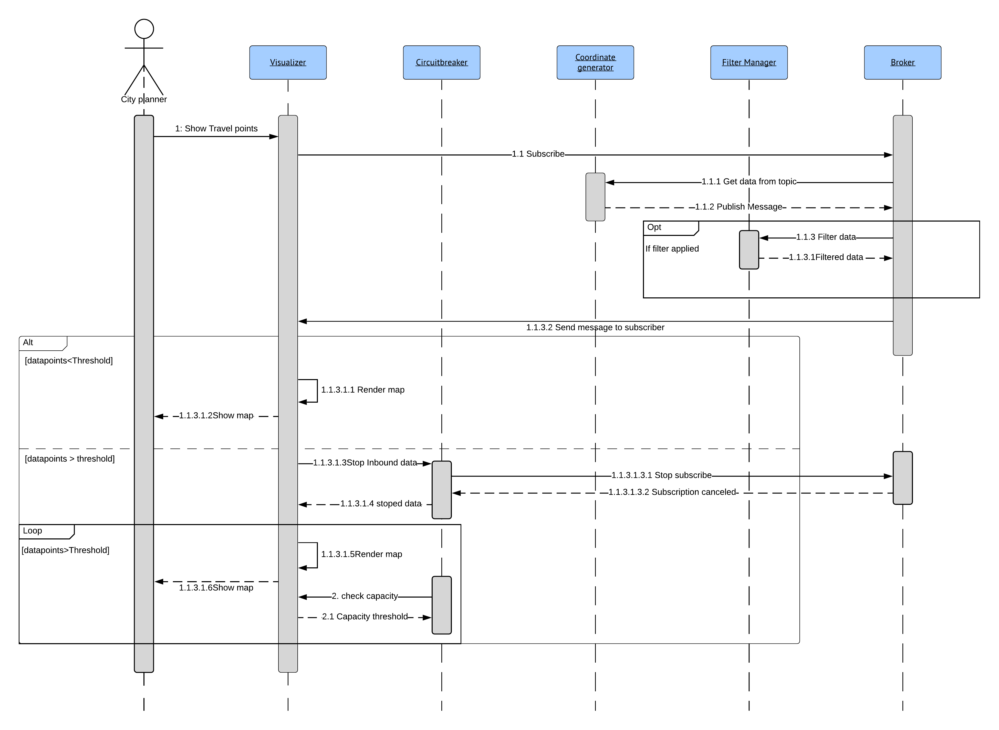
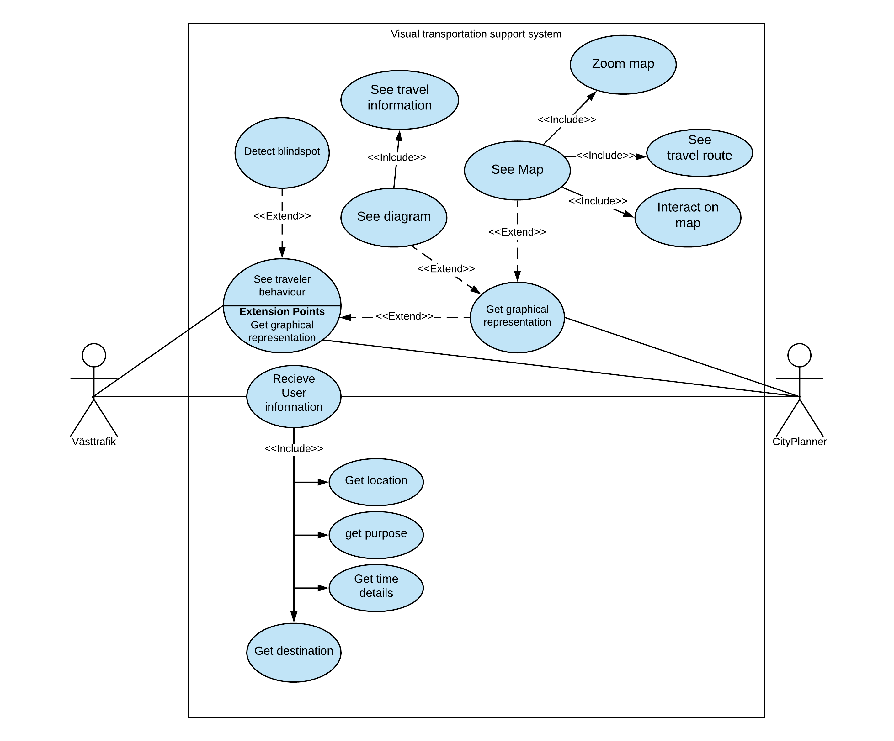

# Visual Transportation Support System 
A Visualization tool to assist city planners and Västtrafik with identifying bottlenecks and blindspots around the city which supports their decisionmaking. 

## Navigate in Readme

* [About](https://git.chalmers.se/courses/dit355/2019/group-9/dit355-project-documentation/tree/master#about)
* [Software Explained](https://git.chalmers.se/courses/dit355/2019/group-9/dit355-project-documentation/tree/master#software-explained)
* [Architectural Styles](https://git.chalmers.se/courses/dit355/2019/group-9/dit355-project-documentation/tree/master#architectural-styles)
* [Forces and Drivers](https://git.chalmers.se/courses/dit355/2019/group-9/dit355-project-documentation/tree/master#forces-and-drivers)
* [Architectural Modelling](https://git.chalmers.se/courses/dit355/2019/group-9/dit355-project-documentation/tree/master#architectural-modelling)
* [Structural diagram](https://git.chalmers.se/courses/dit355/2019/group-9/dit355-project-documentation/tree/master#structural-view)
* [behavioural diagram](https://git.chalmers.se/courses/dit355/2019/group-9/dit355-project-documentation/tree/master#behavioural-view)
* [Use case diagram](https://git.chalmers.se/courses/dit355/2019/group-9/dit355-project-documentation/tree/master#use-case-view)
* [deployment models](https://git.chalmers.se/courses/dit355/2019/group-9/dit355-project-documentation/tree/master#deployment-view)
* [Files](https://git.chalmers.se/courses/dit355/2019/group-9/dit355-project-documentation/tree/master#files)

## About
This is a repository that documents the system.

It consists of sprint plans, requirements, user-stories, architecture, cost analysis forces and drivers amongst other things.

The system will provide useful information such as location, destination, timestamp of travelers, the purpose of travel as well as issuance. 

Transportation companies can use this tool to improve their services through visualization of the travellers data.

The visualization will allow the service provider to identify blindspots and routes which will assist the decision-making of the city planners.

## Software Explained

*  Mosquitto -  It is an infrastructure for the publish and subscribe architectual style
*  Swift - Used to visualize the data on IOS devices
*  Python - Used to generate data and subscribe to topics 
*  Paho - provides mqtt protocol

## Architectural Styles
Software architecture allows us to plan the structure of the system in beforehand so that
we can foresee possible risks, reduce complexity and development time.

The Architectural styles we are using are:
* Publish and Subscripe
* Pipe and filter

##### Publish and subscribe
Subscribers subscribe to a topic they are interested in.
Publisher sends messages and subscribers of that topic recieves them.
Publishers do not know who the subscribers are and vice versa.

##### Pipe and filter
Pump feeds the data which pipes transport.
The data in turn gets transformed in the filer which pipes then transport to the sink.
The sink feeds out the data.

For more details and models read [Architectures](https://git.chalmers.se/courses/dit355/2019/group-9/dit355-project-documentation/tree/master/Architecture)

## Forces and drivers: 
##### Forces:
* Security
* Availability
* Scalability
* Modifiability
* Modularity

##### Drivers:
* Scalability
* Modifiability
* Security
* Modularity

 Read [forces and drivers](https://git.chalmers.se/courses/dit355/2019/group-9/dit355-project-documentation/blob/master/ForcesAndDrivers.md) for additional details and description.

## Architectural modelling: 
With the requirements and our user stories, we have created models.

Each model represent a view of the system.
* Structural view
* Behavioural view
* Use case view
* Deployment view 

### Structural view

#### IOS Class diagram

* to get download version of the model visit  [Models](https://git.chalmers.se/courses/dit355/2019/group-9/dit355-project-documentation/tree/master/Architecture)

__________________________________________________________________________________
#### Publish subscribe component diagram 

The communication layer has the broker component, which is the middleware between the different systems. The broker recieves information from the generator component in the publisher subsystem. The filter subsystem subscribes to specific data via the filter manager component, which also controls which filter to be used. The filters are communication with eachother via the pipe components. The filter republishes to a desired topic via the broker.  The presentation layer holds the data reciever component which will recieve the processed data. It has a data transformer component with the responsibility to transform the data into several session. The different sessions can then be visualized on the graphical view component that uses a map api to show the map. 
* to get download version of the model visit  [Models](https://git.chalmers.se/courses/dit355/2019/group-9/dit355-project-documentation/tree/master/Architecture)

Description:  

__________________________________________________________________________________

#### Conceptual component diagram : pubsub & pipe n filter

The broker component is the communicator/middleware in this distributed system. 
It recieves publishes from the data-generator component. 
The filter recieves the data from the generator and communicatate via another filter through the pipe component. 
The Visualiser is the UI and consist of a data reciever that collects data into multiple sessions. 
The visualizer then display the stored data on a map using a map api.  
*  to get download version of the model visit  [Models](https://git.chalmers.se/courses/dit355/2019/group-9/dit355-project-documentation/blob/master/Architecture/component_diagram_conceptual.jpg)

_________________________________________________________________________________

#### IOS Client component diagram

* to get download version of the model visit  [Models](https://git.chalmers.se/courses/dit355/2019/group-9/dit355-project-documentation/tree/master/Architecture)

__________________________________________________________________________________

### Behavioural view
#### Get traveler behaviour

The user(Västtrafik) chooses to view traveler behaviour. The visualizer will then subscribe to the relevant topic from the broker that is getting publishes from our generator.  The coordinates goes through a filter so that whatever is relevant is given to the visualizer. If the amount of data points received by the visualizer is less than a certain threshold it will render the map and show it to the user.

If the amount of data points are more than the threshold the circuit breaker will stop the inbound data temporarily, the visualizer will keep rendering the map with the data points it has already received and tell the circuit breaker when it is ready to receive more data points.

* to get download version of the model visit  [Models](https://git.chalmers.se/courses/dit355/2019/group-9/dit355-project-documentation/tree/master/Architecture)

__________________________________________________________________________________

#### IOS behavioural view

* to get download version of the model visit  [Models](https://git.chalmers.se/courses/dit355/2019/group-9/dit355-project-documentation/tree/master/Architecture)

__________________________________________________________________________________

#### Use case view

The usecase diagram shows what each actor wants to be able to do.
These usecases are implemented in the system and this shows the relations between the actor and their respective usecases.
The actors are city planners and västtrafik. The square that contains the usecases inside is the system boundary.
The visualizer has two ways to represent data. Either it is from a map or diagrams where the city planners and västtrafik can see the data.
* to get download version of the model visit  [Models](https://git.chalmers.se/courses/dit355/2019/group-9/dit355-project-documentation/tree/master/Architecture)

__________________________________________________________________________________

#### Deployment view

The deployment diagram shows the strcuture of the final system. It encompasses the different types of technologies 
and third party libraries used for the whole system. 
We have 3 major packages along with a transportation package. The reason behind not having the fault tolerance layer within the deployment 
diagram is for the reason that we integrated the fault tolerance within the pipe and filter. 
For the IOS client were using the local components Foundation (Classes, backend logic), UIKit (Internal Interface builder), MapKit (Internal IOS Map), CoreLocation (IOS Location Formatter). Three artifacts which are in essence classes that are using external third party libraries.
The Python API has a script that contains the internal components as different classes. We have three external components JSON, Paho-mqtt, Bus_stops_Gothenburg that assist with formatting, connecting, and data sourcing respectively.
And finaly for the Java API we have the internal components serving the system as different classes as well.  We're using the same external library as used for the Python API and that is Paho, which assists with connectivity.

* to get download version of the model visit  [Models](https://git.chalmers.se/courses/dit355/2019/group-9/dit355-project-documentation/tree/master/Architecture)

__________________________________________________________________________________

## Files
* [User stories](https://git.chalmers.se/courses/dit355/2019/group-9/dit355-project-documentation/blob/master/UserStories.md)
* [Requirements](https://git.chalmers.se/courses/dit355/2019/group-9/dit355-project-documentation/blob/master/SoftwareRequirementSpecification.md)
* [Forces and Drivers](https://git.chalmers.se/courses/dit355/2019/group-9/dit355-project-documentation/blob/master/ForcesAndDrivers.md)
* [Cost analysis](https://git.chalmers.se/courses/dit355/2019/group-9/dit355-project-documentation/blob/master/CostAnalysis.md)
* [Project management documetation](https://git.chalmers.se/courses/dit355/2019/group-9/dit355-project-documentation/tree/master/ProjectManagementReport)
* [Architectures](https://git.chalmers.se/courses/dit355/2019/group-9/dit355-project-documentation/tree/master/Architecture)
* [JSON structure](https://git.chalmers.se/courses/dit355/2019/group-9/dit355-project-documentation/blob/master/jsonTemplate.json)

